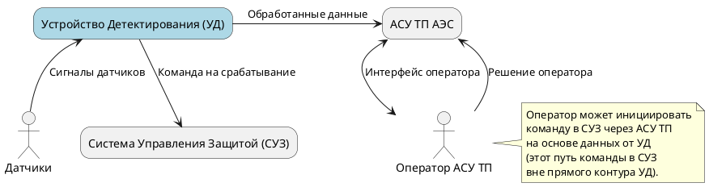
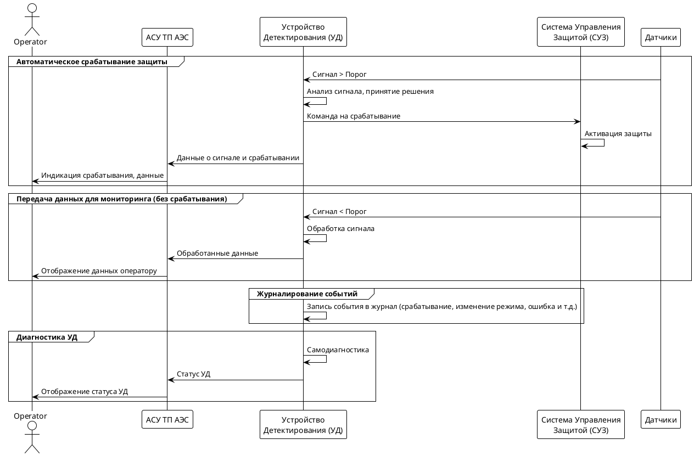
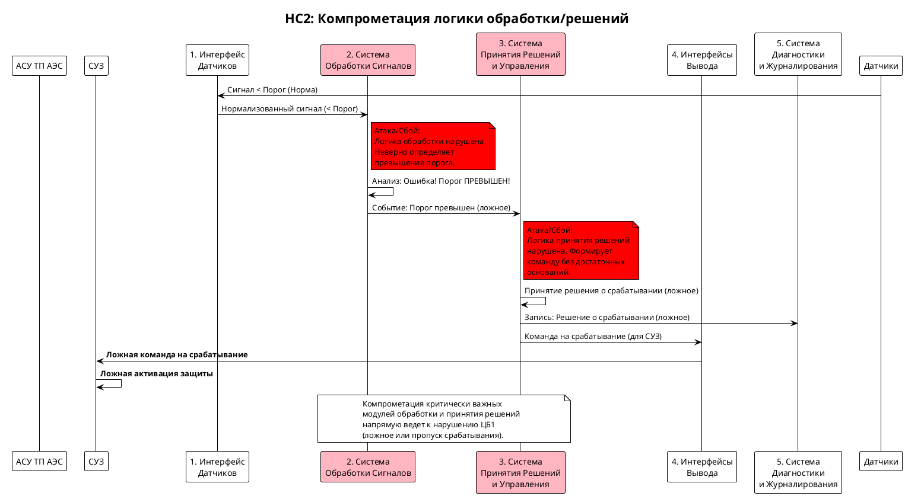

# Концепция безопасности "Устройство Детектирования Реактора"

## Краткое описание проектируемой системы

https://www.plantuml.com/plantuml/png/fPBFwn916CRlyrUyV4yATWcwH8HHzuBDItGPT0bHPsLsFKG4AeI41oC4eKDXdeErTcXRS_qNtlcFUcRM7thEW_lklf_dsUSPLZJZHEfaDEYBkDTLGwdbW6GxYNIGlEs752VTTcyWrTLMX-r4gZTOlXE4duv6glCqqYhKTF-1U2-4rzCTBpcrKplZd0lExqZ658GgZdGipXwWDdO2Qimb_t4J_-JojOBMO3PSu3ztMpnFUOzvGJNUyBBk3LlFRhpMs4-yxY-d1Em0QGhfZaqbXlKAiJvYdhfNmcmDRbNP1QrNDtwVt9BuEtyZp3zuxQadGUlbYtFBhtnWurxZ3EsOhaIUVZuCjGGgnB4ztNkCtFIG-BFzW0oPNRWyRCXESFc5e2dlx5m00efCZlq24gMmp53DCS1zkwq_vldfWE1JSvrzFoZy0SxOmBpWl5wvLXtWY_ZReqi9qZdiuMM8iykDgEX7q9tQEEdoGZI8Yqj0P3zn_z4W0vsx--e3gPg0sNFP8DS8pmp_lZxmkX3DK7NmEVy3

**Устройство Детектирования (УД)** предназначено для обработки сигналов от датчиков реакторной установки.
Ключевые функции:
1.  **Автоматическое срабатывание:** При превышении заданных пороговых значений входящих сигналов, УД автоматически формирует и передает команду на срабатывание в Систему Управления Защитой (СУЗ) реактора.
2.  **Передача данных:** УД передает обработанные данные о параметрах в Автоматизированную Систему Управления Технологическим Процессом (АСУ ТП) АЭС для мониторинга, анализа и архивирования.
3.  **Поддержка административного срабатывания:** Данные, переданные в АСУ ТП, могут использоваться оператором для принятия решения о ручной (административной) выдаче команды в СУЗ.

## Ключевые ценности, ущербы, неприемлемые события

| Ценность                                     | Негативное событие                                                                                                                                                                                                                         | Оценка ущерба | Комментарий                                                      |
| :------------------------------------------- | :----------------------------------------------------------------------------------------------------------------------------------------------------------------------------------------------------------------------------------------- | :------------ | :--------------------------------------------------------------- |
| **Корректная работа защиты реактора**        | **Команда в СУЗ не выдана, когда была необходима** (пропуск события)                                                                                                                                                                       | **Высокий**   | Риск развития аварийной ситуации.                                |
| **Корректная работа защиты реактора**        | **Команда в СУЗ выдана ложно** (без реальной необходимости)                                                                                                                                                                               | **Высокий**   | Ложное срабатывание защиты, останов реактора, экономический ущерб. |
| **Данные** (обрабатываемые, хранимые, передаваемые УД) | Нарушение **целостности** (сигнал изменен), потеря **аутентичности**, сигнал **не обработан** (потерян внутри УД), **не передан** в АСУ ТП.                                                                                            | **Высокий**   | Некорректная работа автоматики (СУЗ), неверные решения оператора. |
| **События в журнале**                        | Событие не зарегистрировано, событие искажено, зарегистрировано ложное событие, событие удалено.                                                                                                                                             | **Средний**   | Сложности при расследовании инцидентов, невозможность анализа.     |
| **Целостность и доступность ПО УД** (Обновление) | Применена неаутентичная прошивка. <br> Аутентичная прошивка привела к: <br> - "окирпичиванию" устройства <br> - возможности установки любой прошивки в будущем <br> - непрохождению внешних тестов <br> - отсутствию реакции на негативные тесты | **Средний**   | Потеря функциональности, уязвимости, затраты на восстановление. |

## Контекст



## Основные функциональные сценарии



## Высокоуровневая архитектура

```plantuml
@startuml
skinparam rectangle {
    roundCorner 25
    shadowing false
    backgroundColor White
    borderColor Black
}

rectangle "1. Интерфейс\nДатчиков" as IF_Sensors
rectangle "2. Система\nОбработки Сигналов" as Processing
rectangle "3. Система\nПринятия Решений\nи Управления" as Control
rectangle "4. Интерфейсы\nВывода (СУЗ, АСУ ТП)" as IF_Output
rectangle "5. Система\nДиагностики\nи Журналирования" as DiagLog

IF_Sensors -> Processing : Входные сигналы
Processing -> Control : Результаты обработки
Control -> IF_Output : Команды (СУЗ), Данные (АСУ ТП)
Processing -> DiagLog : Данные для журнала
Control -> DiagLog : События для журнала
DiagLog -> Processing : Статус компонентов (для возможной корректировки)
DiagLog -> Control : Статус компонентов
DiagLog -> IF_Output : Статус для АСУ ТП

@enduml
```



### Описание подсистем

| Название                                 | Назначение                                                                                                                            |
| :--------------------------------------- | :------------------------------------------------------------------------------------------------------------------------------------ |
| 1. Интерфейс Датчиков                    | Прием и первичная обработка (фильтрация, нормализация) сигналов от физических датчиков.                                               |
| 2. Система Обработки Сигналов            | Основная логика анализа сигналов, сравнение с порогами, выявление условий для срабатывания защиты.                                   |
| 3. Система Принятия Решений и Управления | Формирование команды на срабатывание для СУЗ на основе решения Системы Обработки. Управление режимами работы УД.                      |
| 4. Интерфейсы Вывода (СУЗ, АСУ ТП)       | Передача команды в СУЗ по соответствующему интерфейсу. Передача обработанных данных и статусной информации в АСУ ТП.                  |
| 5. Система Диагностики и Журналирования  | Мониторинг состояния компонентов УД, самодиагностика, ведение защищенного журнала событий (срабатывания, ошибки, действия, изменения). |

## Расширенные диаграммы функциональных сценариев

*Иллюстрация взаимодействия подсистем во время автоматического срабатывания*


## Цели и предположения безопасности

### Цели безопасности (ЦБ)

1.  **ЦБ1 (Корректность срабатывания):** УД должно генерировать и передавать команду в СУЗ *тогда и только тогда*, когда легитимные сигналы от датчиков соответствуют критериям срабатывания, определенным в конфигурации УД. (Покрывает риск ложного и пропуска срабатывания).
2.  **ЦБ2 (Целостность и Аутентичность Данных):** Данные, передаваемые из УД в АСУ ТП, должны быть целостными и аутентичными (не искажены, источник подтвержден). Сигналы внутри УД должны сохранять целостность на всех этапах обработки.
3.  **ЦБ3 (Целостность и Доступность Журнала):** Журнал событий должен быть защищен от несанкционированного изменения, удаления и быть доступным для авторизованного анализа. События должны регистрироваться корректно и своевременно.
4.  **ЦБ4 (Безопасное Обновление и Конфигурирование):** Должна быть обеспечена возможность установки только аутентичного и целостного ПО и конфигурации. Процесс обновления не должен приводить к нарушению функционирования УД или созданию уязвимостей.

### Предположения безопасности

1.  **ПБ1 (Физическая безопасность):** Физический доступ к УД и подключенным линиям связи (датчики, СУЗ, АСУ ТП) контролируется и защищен в рамках общей физической безопасности АЭС.
2.  **ПБ2 (Безопасность смежных систем):** Предполагается, что СУЗ корректно обрабатывает полученную от УД команду. АСУ ТП и действия оператора АСУ ТП находятся вне скоупа безопасности самого УД, но УД должно предоставлять им корректные данные. Безопасность самих датчиков (защита от подмены сигнала до УД) предполагается обеспеченной.
3.  **ПБ3 (Надежность электропитания):** Предполагается наличие надежного и бесперебойного электропитания для УД.

### Таблица соотнесения ценностей, неприемлемых событий и целей безопасности

| Ценность                                     | Негативное событие                                                                                                                                                                                                                         | Оценка ущерба | Цель(и) безопасности |
| :------------------------------------------- | :----------------------------------------------------------------------------------------------------------------------------------------------------------------------------------------------------------------------------------------- | :------------ | :------------------- |
| Корректная работа защиты реактора        | Команда в СУЗ не выдана, когда была необходима                                                                                                                                                                       | Высокий       | **ЦБ1**              |
| Корректная работа защиты реактора        | Команда в СУЗ выдана ложно                                                                                                                                                                               | Высокий       | **ЦБ1**              |
| Данные                                     | Нарушение целостности, потеря аутентичности, сигнал не обработан, не передан в АСУ ТП.                                                                                                                             | Высокий       | **ЦБ1, ЦБ2**         |
| События в журнале                        | Событие не зарегистрировано, искажено, ложное событие, удалено.                                                                                                                                             | Средний       | **ЦБ3**              |
| Целостность и доступность ПО УД        | Неаутентичная прошивка, "окирпичивание", потеря защиты при обновлении, нарушение тестов.                                                                                                                           | Средний       | **ЦБ4**              |

## Негативные сценарии

### Негативный сценарий №1: Искажение данных на входе или выходе (Нарушение ЦБ1, ЦБ2)


### Негативный сценарий №2: Компрометация логики обработки (Нарушение ЦБ1)



## Политика архитектуры

### Версия 1 (Начальная)

На основе анализа рисков и целей безопасности, назначаем начальные уровни доверия компонентам.

```plantuml
@startuml
skinparam rectangle {
    roundCorner 25
    shadowing false
    borderColor Black
}

legend right
    | Symbol | Meaning |
    | <&shield> | Trusted Component |
    | <&warning> | Untrusted Component |
    | SS | Small Size & Complexity |
    | MM | Medium Size & Complexity |
    | LL | Large Size & Complexity |

    rectangle "#lightgreen" as TrustedColor {
     Trusted (Доверенный)
    }
    rectangle "#lightcoral" as UntrustedColor {
     Untrusted (Недоверенный)
    }

    TrustedColor -[hidden] UntrustedColor

    note top of TrustedColor
     Компонент, отказ которого
     напрямую нарушает ЦБ
    end note
    note top of UntrustedColor
     Компонент, отказ которого
     не нарушает ЦБ напрямую
     или его влияние
     контролируется другими
     компонентами
    end note
end legend

rectangle "1. Интерфейс\nДатчиков <&warning>" as IF_Sensors #lightcoral [[MM]]
rectangle "2. Система\nОбработки Сигналов <&shield>" as Processing #lightgreen [[MM]]
rectangle "3. Система\nПринятия Решений\nи Управления <&shield>" as Control #lightgreen [[MM]]
rectangle "4. Интерфейсы\nВывода (СУЗ, АСУ ТП) <&shield>" as IF_Output #lightgreen [[MM]]
rectangle "5. Система\nДиагностики\nи Журналирования <&warning>" as DiagLog #lightcoral [[MM]]

IF_Sensors -[#red,bold]-> Processing : Входные сигналы
Processing -[#green,bold]-> Control : Результаты обработки
Control -[#green,bold]-> IF_Output : Команды (СУЗ), Данные (АСУ ТП)
Processing -[#red,bold]-> DiagLog : Данные для журнала
Control -[#red,bold]-> DiagLog : События для журнала
DiagLog -[#red,bold]-> Processing : Статус компонентов
DiagLog -[#red,bold]-> Control : Статус компонентов
DiagLog -[#red,bold]-> IF_Output : Статус для АСУ ТП

@enduml
```

| Домен безопасности                       | Уровень доверия                  | Оценка сложности и размера домена | Обоснование                                                                                                                              |
| :--------------------------------------- | :------------------------------- | :-------------------------------- | :--------------------------------------------------------------------------------------------------------------------------------------- |
| 1. Интерфейс Датчиков                    | Недоверенный                     | MM                                | Компрометация может привести к неверным входным данным, но ЦБ1 зависит от последующей обработки. Нарушает ЦБ2.                           |
| 2. Система Обработки Сигналов            | **Доверенный**                     | MM                                | **Критический компонент.** Ошибка/компрометация напрямую нарушает **ЦБ1** (определение условия срабатывания).                             |
| 3. Система Принятия Решений и Управления | **Доверенный**                     | MM                                | **Критический компонент.** Ошибка/компрометация напрямую нарушает **ЦБ1** (формирование команды). Влияет на **ЦБ4** (управление).        |
| 4. Интерфейсы Вывода (СУЗ, АСУ ТП)       | **Доверенный**                     | MM                                | **Критический компонент.** Отвечает за *доставку* критической команды (ЦБ1) и целостность данных для АСУ ТП (ЦБ2).                     |
| 5. Система Диагностики и Журналирования  | Недоверенный                     | MM                                | Компрометация нарушает **ЦБ3**, но напрямую не вызывает ложного/пропуска срабатывания (ЦБ1). Затрудняет анализ инцидентов.          |

*Проблема V1:* Большая поверхность атаки на доверенные компоненты (Processing, Control, IF_Output). Сложность (MM) этих компонентов затрудняет их верификацию и обеспечение безопасности.

### Версия 2 (Кибериммунный подход)

Вводим **Монитор Безопасности (МБ)**, который становится ядром доверенной базы. Его задача - контролировать взаимодействие между основными компонентами и проверять критические решения перед их исполнением.

```plantuml
@startuml
skinparam rectangle {
    roundCorner 25
    shadowing false
    borderColor Black
}

legend right
    | Symbol | Meaning |
    | <&shield> | Trusted Component |
    | <&warning> | Untrusted Component |
    | SS | Small Size & Complexity |
    | MM | Medium Size & Complexity |
    | LL | Large Size & Complexity |

    rectangle "#lightgreen" as TrustedColor {
     Trusted (Доверенный)
    }
    rectangle "#lightcoral" as UntrustedColor {
     Untrusted (Недоверенный)
    }

    TrustedColor -[hidden] UntrustedColor

    note top of TrustedColor
     Компонент, отказ которого
     напрямую нарушает ЦБ,
     ИЛИ компонент, реализующий
     политику безопасности (Монитор)
    end note
    note top of UntrustedColor
     Компонент, отказ которого
     контролируется Монитором
     Безопасности или не влияет
     на ключевые ЦБ.
    end note
end legend

rectangle "1. Интерфейс\nДатчиков <&warning>" as IF_Sensors #lightcoral [[MM]]
rectangle "2. Система\nОбработки Сигналов <&warning>" as Processing #lightcoral [[MM]]
rectangle "3. Система\nПринятия Решений\nи Управления <&warning>" as Control #lightcoral [[MM]]
rectangle "4. Интерфейсы\nВывода (СУЗ, АСУ ТП) <&warning>" as IF_Output #lightcoral [[MM]]
rectangle "5. Система\nДиагностики\nи Журналирования <&warning>" as DiagLog #lightcoral [[MM]]
rectangle "**6. Монитор\nБезопасности <&shield>**" as Monitor #lightgreen [[SS]]

' Связи через Монитор (пример)
IF_Sensors -[#red,bold]-> Monitor : Входные сигналы (для валидации)
Monitor -[#green,bold]-> Processing : Валидированные сигналы

Processing -[#red,bold]-> Monitor : Результат обработки (кандидат решения)
Monitor -[#green,bold]-> Control : Подтверждение решения (если валидно)

Control -[#red,bold]-> Monitor : Команда на отправку (СУЗ/АСУ ТП)
Monitor -[#green,bold]-> IF_Output : Разрешение на отправку + данные

' Прямые связи (могут остаться для некритичных данных, если разрешено политикой Монитора)
' DiagLog может взаимодействовать с другими компонентами через Monitor или напрямую (в зависимости от политики)
DiagLog -[#red,bold]-> Monitor : Запросы на логирование / Статус
Monitor -[#red,bold]-> DiagLog : Команды логирования

@enduml
```

| Домен безопасности                       | Уровень доверия                                   | Оценка сложности и размера домена | Обоснование                                                                                                                                                              |
| :--------------------------------------- | :------------------------------------------------ | :-------------------------------- | :----------------------------------------------------------------------------------------------------------------------------------------------------------------------- |
| 1. Интерфейс Датчиков                    | Недоверенный                                      | MM                                | Работает под контролем МБ. Нарушение ЦБ2 блокируется МБ.                                                                                                                 |
| 2. Система Обработки Сигналов            | Недоверенный                                      | MM                                | Работает под контролем МБ. Попытка нарушения ЦБ1 (неверная обработка) блокируется МБ при проверке решения.                                                                 |
| 3. Система Принятия Решений и Управления | Недоверенный                                      | MM                                | Работает под контролем МБ. Попытка нарушения ЦБ1 (неверное решение/команда) или ЦБ4 (неверная конфигурация) блокируется МБ.                                                     |
| 4. Интерфейсы Вывода (СУЗ, АСУ ТП)       | Недоверенный                                      | MM                                | Работает под контролем МБ. Попытка нарушения ЦБ1 (отправка неавторизованной команды) или ЦБ2 (искажение данных) блокируется МБ.                                                 |
| 5. Система Диагностики и Журналирования  | Недоверенный                                      | MM                                | Работает под контролем МБ. Попытка нарушения ЦБ3 может быть частично проконтролирована МБ (например, контроль потока логов).                                                   |
| **6. Монитор Безопасности (МБ)**         | **Доверенный, повышающий целостность и контроль** | **SS**                            | **Ядро доверенной базы.** Реализует политику безопасности: проверяет взаимодействия, валидирует критические данные и решения (ЦБ1, ЦБ2, ЦБ4). Малый размер облегчает верификацию. |

*Преимущества V2:* Значительное сокращение доверенной вычислительной базы до одного компонента (Монитор Безопасности) с минимальной сложностью (SS). Остальные компоненты становятся недоверенными, их потенциально некорректное поведение контролируется МБ, что повышает общую безопасность и устойчивость системы к атакам и сбоям. Реализует принципы кибериммунитета.

## Прототип системы

*На данном этапе прототип не разрабатывается, но здесь могла бы быть ссылка на него (например, на модель в Simulink, код на KasperskyOS, Jupyter Notebook и т.д.).*
